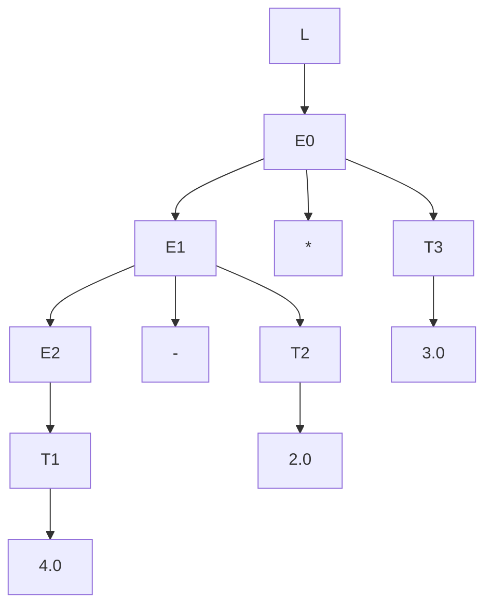
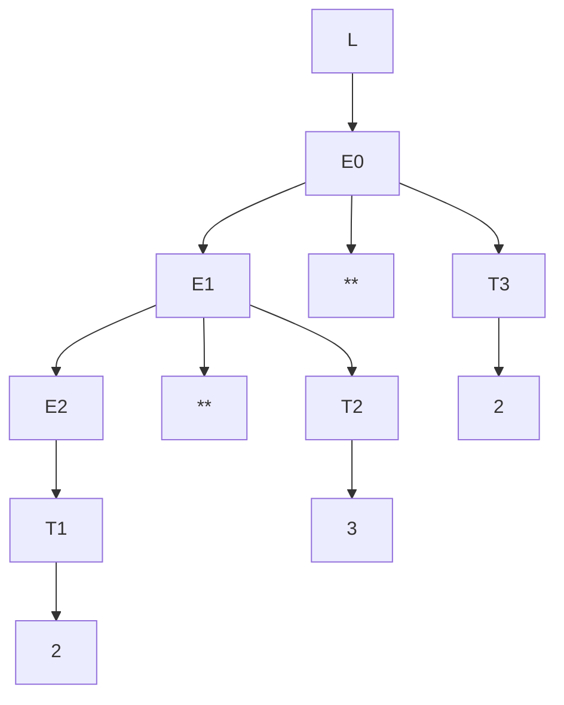

# Informe práctica 5

Asignatura PL 

Jison is a tool that receives as input a Syntax Directed Translation and produces as output a JavaScript parser  that executes the semantic actions in a bottom up ortraversing of the parse tree.

## Escriba la derivación para cada una de las frases.
`4.0-2.0*3.0`
L ⇒ E eof ⇒ E * T eof ⇒ E - T * T eof ⇒ T - T * T eof ⇒ 4.0 - T * T eof ⇒ 4.0 - 2.0 * T eof ⇒ 4.0 - 2.0 * 3.0 eof
`2**3**2`
L ⇒ E eof ⇒ E ** T eof ⇒ E ** T ** T eof ⇒ T ** T ** T eof ⇒ 2 ** T ** T eof ⇒ 2 ** 3 ** T eof ⇒ 2 ** 3 ** 2 eof
`7-4/2`
L ⇒ E eof ⇒ E / T eof ⇒ E - T / T eof ⇒ T - T / T eof ⇒ 7 - T / T eof ⇒ 7 - 4 / T eof ⇒ 7 - 4 / 2 eof

## Escriba el árbol de análisis sintáctico (parse tree) para cada una de las frases.
`4.0-2.0*3.0`

`2**3**2`

`7-4/2`
```mermaid
graph TD
    L --> E0
    E0 --> E1
    E0 --> op_div[/]
    E0 --> T3
    E1 --> E2
    E1 --> op_minus[-]
    E1 --> T2
    E2 --> T1
    T1 --> num1[7]
    T2 --> num2[4]
    T3 --> num3[2]
```
## ¿En qué orden se evaluan las acciones semánticas para cada una de las frases?
`4.0-2.0*3.0`
T.value = convert("4.0")
E.value = T.value (desde E → T para el 4.0)
T.value = convert("2.0")
E.value = operate('-', E.value(4.0), T.value(2.0)) = 4.0 - 2.0 = 2.0
T.value = convert("3.0")
E.value = operate('*', E.value(2.0), T.value(3.0)) = 2.0 * 3.0 = 6.0
L.value = E.value(6.0)
Resultado final: 6.0 

`2**3**2`
T.value = convert("2")
E.value = T.value (desde E → T para el primer 2)
T.value = convert("3")
E.value = operate('**', E.value(2), T.value(3)) = 2 ** 3 = 8
T.value = convert("2")
E.value = operate('**', E.value(8), T.value(2)) = 8 ** 2 = 64
L.value = E.value(64)
Resultado final: 64 

`7-4/2`
T.value = convert("7")
E.value = T.value (desde E → T para el 7)
T.value = convert("4")
E.value = operate('-', E.value(7), T.value(4)) = 7 - 4 = 3
T.value = convert("2")
E.value = operate('/', E.value(3), T.value(2)) = 3 / 2 = 1.5
L.value = E.value(1.5)
Resultado final: 1.5
